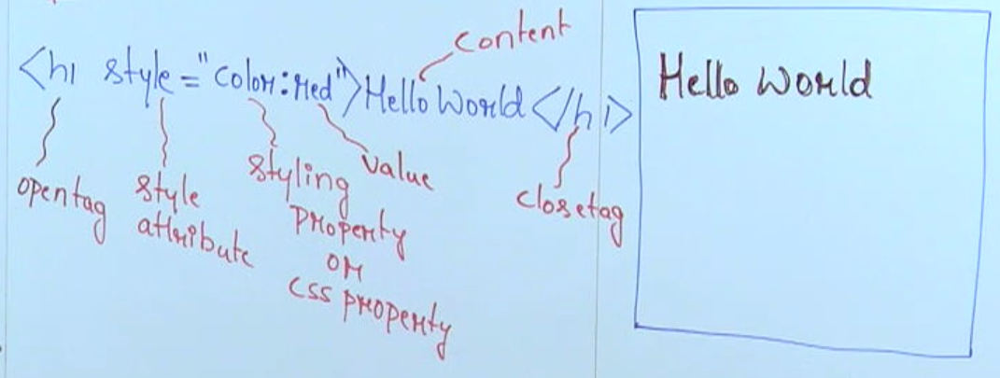
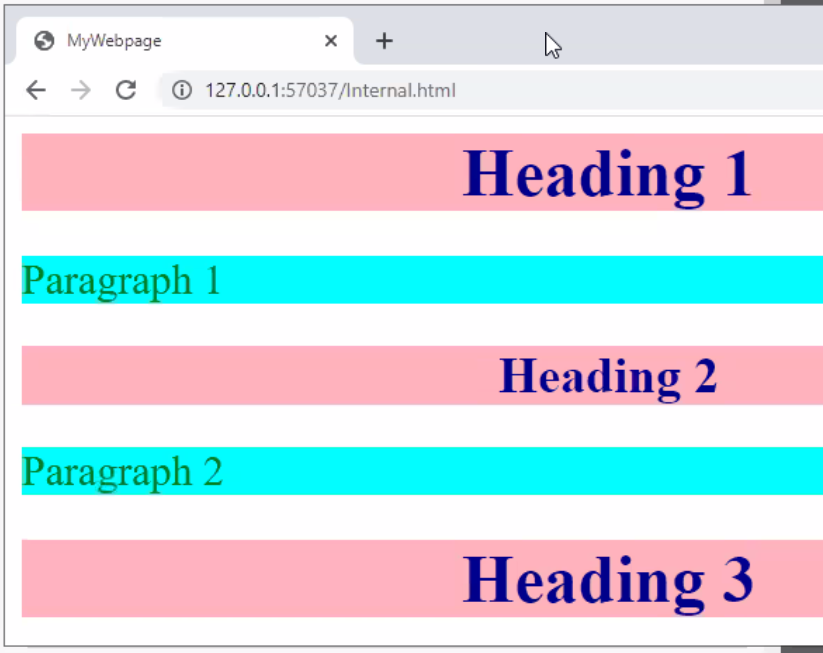
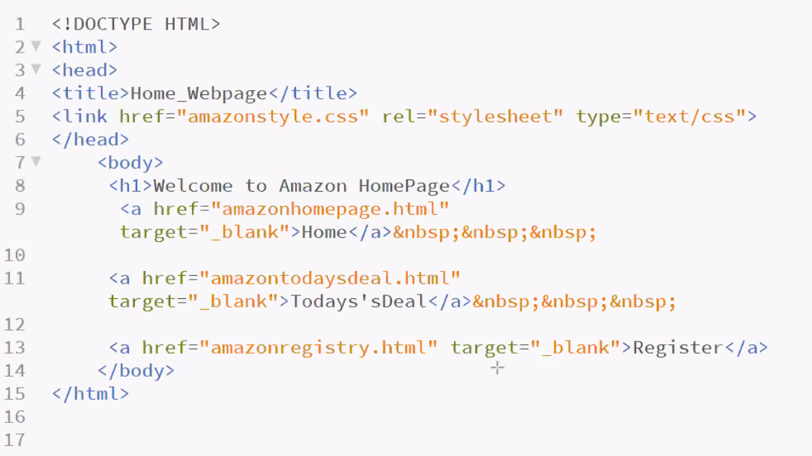

# CSS (Cascading Style Sheet)

## Syntax



# Basic CSS Styling Properties

1. [Color](#color)
1. [font-family](#font-family)
1. [font-size](#font-size)
1. [text-align](#text-align)
1. [background-color](#background-color)
1. [border](#border)

## Color

```html
<h1 style="color:red">Hello World</h1>
```

> Output
>
> <h1 Style="color:red">Hello World</h1>

---

## Font Family

```html
<h1 style="font-family:cursive">Hello World</h1>
```

> Output
>
> <h1 Style="font-family:cursive">Hello World</h1>

---

## Text Align

```html
<h1 style="text-align:center">Hello World</h1>
```

> Output
>
> <h1 Style="text-align:center">Hello World</h1>

---

## Font Size

```html
<h1 style="font-size:20px">Hello World</h1>
```

> Output
>
> <h1 Style="font-size:20px">Hello World</h1>

---

## Background Color

```html
<h1 style="background-color:blue">Hello World</h1>
```

> Output
>
> <h1 Style="background-color:blue">Hello World</h1>

---

## Border

```html
<h1 style="border:solid">Hello World</h1>
```

> Output
>
> <h1 Style="border:solid red">Hello World</h1>

---

### Example

```html
<h2
  style="color:green;
font-fami ly : cursive;
text-align: center;
font-size:25px;
background-color: yellow;
border: solid"
>
  Welcome to HTML and CSS
</h2>
```

<h2
  style="color:green;
font-fami ly : cursive;
text-align: center;
font-size:25px;
background-color: yellow;
border: solid"
>
  Welcome to HTML and CSS
</h2>

# Types of CSS

- There are three types of css
  1. [Inline CSS](#inline-css) - Styled is used as attribute
  1. [Internal CSS](#internal-css) - Style is used as tag
  1. [External CSS](#external-css) - Style is used as stylesheet

## Inline CSS

<dd>Inline CSS is used to apply unique style to single element in the web page.
    <br>Style is used as attribute
</dd>
    
### Example
```html

<h1 style="color:red">Hello World</h1>
<h1 style="color:green">Hello World</h1>
```

## Internal CSS

#### Example

```html
<html>
  <head>
    <title>My WebPage</title>

    <style>
      hl,
      h2 {
        color: darkbtue;
        background—color: tightpink;
        text-align: center;
      }
      p {
        color: green;
        background-color: aqua;
        font-size: 20px;
      }
    </style>
  </head>
  <body>
    <h1>Heading1</h1>
    <p>Paragraph</p>
    <h1>Heading2</h1>
    <p>Paragraph</p>
    <h1>Heading2</h1>
  </body>
</html>
```

> ### Output
>
> 

## External CSS


### Example



### Notes

- External CSS is used to add common styling for different web elements in different webpages.

In external css separate style sheet is created and linked for multiple webpages(html files) in the web application.

- \<link> tag is used to link the stylesheet to the html file.
- \<link> tag must be used inside the head tag

In the \<link> tag, rel="stylesheet" attribute specifies the relationship of the html file and css file.

- href attribute specifies which stylesheet must be added to the html file.

- type="text/css" attribute specifies the type of file.
