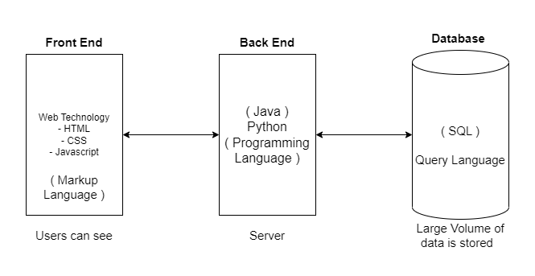
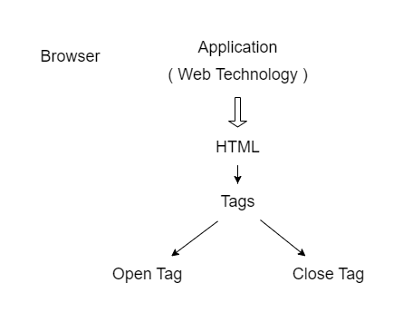

<!-- START doctoc generated TOC please keep comment here to allow auto update -->
<!-- DON'T EDIT THIS SECTION, INSTEAD RE-RUN doctoc TO UPDATE -->
**Contents**

- [Introduction to Web Tech](#introduction-to-web-tech)
  - [Different types of Application](#different-types-of-application)
    - [Web Application](#web-application)
  - [Architecture of Web Application](#architecture-of-web-application)
  - [HTML (Hyper Text Markup Language)](#html-hyper-text-markup-language)
    - [Difference between Markup and Programming Language](#difference-between-markup-and-programming-language)
- [Tags in HTML](#tags-in-html)

<!-- END doctoc generated TOC please keep comment here to allow auto update -->

# Introduction to Web Tech

## Different types of Application

- Mobile Application - Mobile
- Desktop Application - Desktop/ Laptop
- Web Application - Browser (Chrome, Firefox)

### Web Application

<dd>Web application is application or a software which can be accessed using the browser.</dd>

 

## Architecture of Web Application

---

Any web applications contains 3 layers ie. front end, backend and database.

- frontend of the web application is designed using Web Technologies i.e. HTML,CSS and Javascript.
- Backend of the web application is designed using different programming languages. i.e Java Python etc
- Database of the web application is designed using query language i.e sql.

Front end is also considered as "client side" of the web application.

Backend is also considered as "server side" of the web application.

Example of web application:

- All the shopping sites i.e. Flipkart, Amazon, Shopsy, Myntra, etc
- All the ticket booking sites, All the online examination sites, etc.

## HTML (Hyper Text Markup Language)

### Difference between Markup and Programming Language

| Markup Language                   | Programming Language                   |
| --------------------------------- | -------------------------------------- |
| Input : 5+5                       | Input : 5+5                            |
| Output : 5+5                      | Output : 10                            |
| Computation is not performed      | Computation is performed               |
| Presentation of data is important |                                        |
| Example : HTML, XML, XHTML, SGML  | Example : Java, C++, Python, .net, etc |

---

 

# Tags in HTML

---

Any web application can be accessed using the browser. There are different browsers available such as chrome, firefox, opera, IE, safari, etc.

- Browser can understand only HTML or markup languages.
- HTML code is a combination Of different types Of tags.
- Using tags we can pass instruction to the browser.

#### Tags:

<dd>Tags in html is a mechanism to instruct the browser. There are two type Of tag structures i.e. open tag and close tag.</dd>

    Open tag represented as < >

    Close tag is represented as </ >
