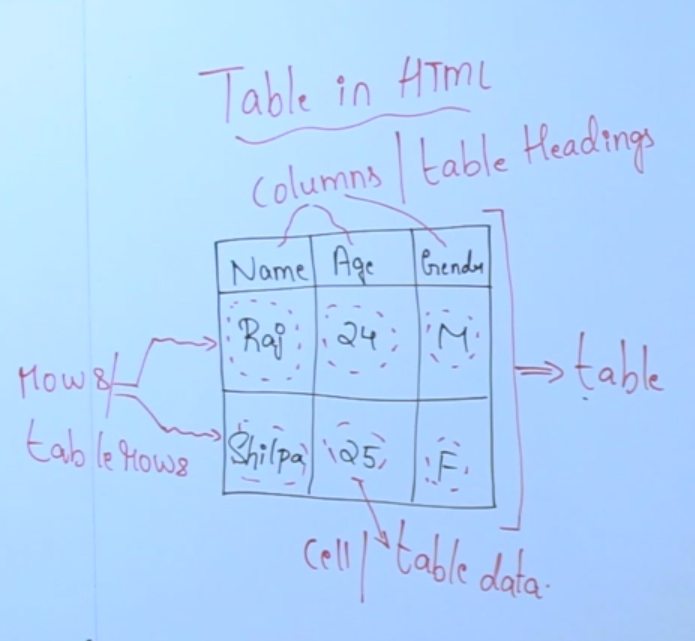

<!-- START doctoc generated TOC please keep comment here to allow auto update -->
<!-- DON'T EDIT THIS SECTION, INSTEAD RE-RUN doctoc TO UPDATE -->
**Contents**

- [Tables in HTML](#tables-in-html)
  - [Table Tag in HTML](#table-tag-in-html)
    - [Example](#example)
    - [Output :](#output-)
  - [colspan attribute](#colspan-attribute)
    - [Example](#example-1)
    - [Output :](#output--1)
  - [colspan attribute](#colspan-attribute-1)
    - [Example](#example-2)
    - [Output :](#output--2)
- [Assignment](#assignment)

<!-- END doctoc generated TOC please keep comment here to allow auto update -->

# Tables in HTML



## Table Tag in HTML

    <table> => Table Tag
    <th>    => Table Heading
    <tr>    => Table Row
    <td>    => Table Data

### Example

```html
<table border>
  <th>Name</th>
  <th>Age</th>
  <th>Gender</th>
  <tr>
    <td>Raj</td>
    <td>24</td>
    <td>M</td>
  </tr>
  <tr>
    <td>Shilpa</td>
    <td>25</td>
    <td>F</td>
  </tr>
</table>
```

### Output :

<table border>
    <th>Name</th>
    <th>Age</th>
    <th>Gender</th>
    <tr>
        <td>Raj</td>
        <td>24</td>
        <td>M</td>
    </tr>
    <tr>
        <td>Shilpa</td>
        <td>25</td>
        <td>F</td>
    </tr>
</table>

---

## colspan attribute

---

- colspan attribute is used to merge two or more columns in the table

### Example

```html
<table border>
  <th colspan="2">Full Name</th>
  <th>Age</th>
  <th>Gender</th>
  <tr>
    <td>Raj</td>
    <td>Sharma</td>
    <td>24</td>
    <td>M</td>
  </tr>
  <tr>
    <td>Shilpa</td>
    <td>Shetty</td>
    <td>25</td>
    <td>F</td>
  </tr>
</table>
```

### Output :

<table border>
    <th colspan="2">Full Name</th>
    <th>Age</th>
    <th>Gender</th>
    <tr>
        <td>Raj</td>
        <td>Sharma</td>
        <td>24</td>
        <td>M</td>
    </tr>
    <tr>
        <td>Shilpa</td>
        <td>Shetty</td>
        <td>25</td>
        <td>F</td>
    </tr>
</table>

## colspan attribute

---

- rowspan attribute is used to merge two or more rows in the table

### Example

```html
<table border>
  <th colspan="2">Full Name</th>
  <th>Age</th>
  <th>Gender</th>
  <tr>
    <td>Raj</td>
    <td>Sharma</td>
    <td>24</td>
    <td>M</td>
  </tr>
  <tr>
    <td>Shilpa</td>
    <td>Shetty</td>
    <td>25</td>
    <td>F</td>
  </tr>
</table>
```

### Output :

<table border>
    <th colspan="2">Full Name</th>
    <th>Age</th>
    <th>Gender</th>
    <th>City</th>
    <tr>
        <td>Raj</td>
        <td>Sharma</td>
        <td>24</td>
        <td>M</td>
        <td rowspan="2">Bangalore</td>
    </tr>
    <tr>
        <td>Shilpa</td>
        <td>Shetty</td>
        <td>25</td>
        <td>F</td>
    </tr>
</table>

---

# Assignment

```html
<table border>
  <th colspan="2">Add</th>
  <th colspan="2">Sub</th>
  <tr>
    <td>10</td>
    <td>20</td>
    <td>10</td>
    <td>20</td>
  </tr>
  <tr>
    <td colspan="2">30</td>
    <td colspan="2">-10</td>
  </tr>
</table>
```

<table border>
    <th rowspan="3">Athematic <br> Operation</th>
    <th colspan="2">Add</th>
    <th colspan="2">Sub</th>
    <tr>
        <td>10</td>
        <td>20</td>
        <td>30</td>
        <td>20</td>
    </tr>
    <tr>
        <td colspan="2">30</td>
        <td colspan="2">10</td>
    </tr>
</table>
