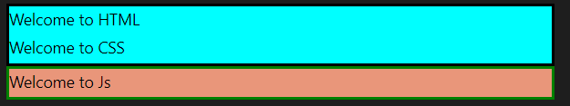

<!-- START doctoc generated TOC please keep comment here to allow auto update -->
<!-- DON'T EDIT THIS SECTION, INSTEAD RE-RUN doctoc TO UPDATE -->
**Contents**

- [Div](#div)
    - [Code](#code)
- [Span Tag](#span-tag)
  - [Example](#example)
    - [Code](#code-1)
    - [Output](#output)

<!-- END doctoc generated TOC please keep comment here to allow auto update -->

# Div

<dd>Its used to create a block of content in the web page.</dd>

### Code

```html
<div>
  <div
    style="
    border: solid black;
    background: aqua;
    "
  >
    <h4 style="color:black">Welcome to HTML</h4>
    <h4 style="color:black">Welcome to CSS</h4>
  </div>
  <div
    style="
    border: solid green;
    background: darksalmon;
    "
  >
    <h4 style="color:black">Welcome to Js</h4>
  </div>
</div>
```

# Span Tag

## Example

### Code

```html
<div
  style="
        font-size: 50px; 
        font-family: Arial, Helvetica, sans-serif; 
        font-weight: 600; 
        text-align: center;"
>
  <span style="color: #4285f4;">G</span>
  <span style="color: #ea4335;">o</span>
  <span style="color: #fbbc05;">o</span>
  <span style="color: #4285f4;">g</span>
  <span style="color: #34a853;">l</span>
  <span style="color: #ea4335;">e</span>
</div>
```

### Output

