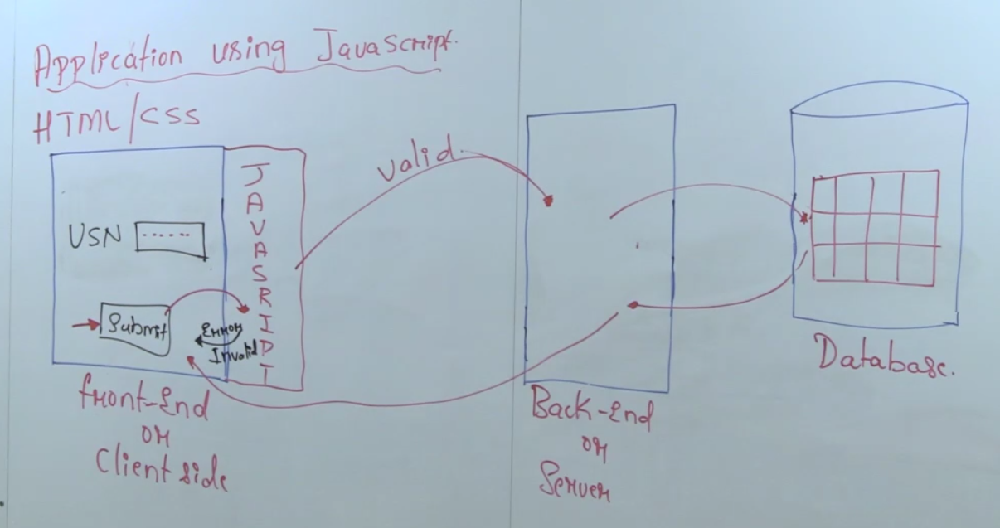
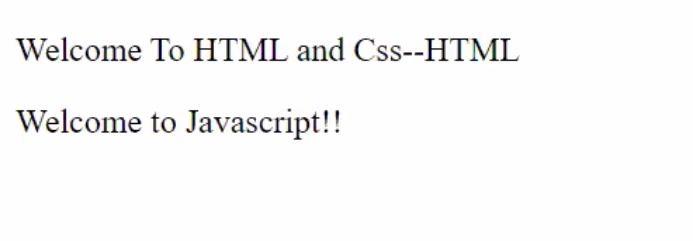

<!-- START doctoc generated TOC please keep comment here to allow auto update -->
<!-- DON'T EDIT THIS SECTION, INSTEAD RE-RUN doctoc TO UPDATE -->
**Contents**

- [Introduction to Javascript](#introduction-to-javascript)
  - [Advantages of Javascript](#advantages-of-javascript)
  - [Internal javascript](#internal-javascript)
    - [output :](#output-)
  - [External Javascript](#external-javascript)
    - [Demo.js](#demojs)
    - [first.html](#firsthtml)

<!-- END doctoc generated TOC please keep comment here to allow auto update -->

# Introduction to Javascript

- **HTML** is used to add the content in the web page.
- **CSS** is used for styling the web page.
- **Javascript** is used for performing validation and action in the web page.



1. Javascript is a front end technology which is used to perform validation and action in the client side.

1. Using Javascript in the front end we can perform client side validation which helps in sending the load of validation to the server.

1. It is good practice for a web developer to validate the data in the front-end and send the valid data from the client side to the server side.

## Advantages of Javascript

1. Using Javascript client-side validation is achieved.
1. Less sever load is given from the front end.
1. Validation and action can be performed in the font end.
1. Validation and action can be performed in the font end.
1. Using Javascript we can manipulate Html and css.

## Internal javascript

1. For creating Internal Javascript code, Html provides `<script>` tag.
1. `<script>` tag is a paired tag and it is preferable to use `<script>` tag inside the `<body>` tag.
1. In Javascript, browser body is called as "Document".

```html
<!DOCTYPE html>
<html>
  <head>
    <title>Document</title>
  </head>
  <body>
    <p>Welcome to HTML and Css--HTML</p>
    <script>
      document.write("Welcome to Javascript!!");
    </script>
  </body>
</html>
```

### output :



## External Javascript

1. External Javascript file is stored with the `.js` extension
1. In the html file , external javascript file is linked using the following syntax:

`<script src="filename.js"></script>`

### Demo.js

```js
document.write("Welcome to Javascript");
```

### first.html

```html
<!DOCTYPE html>
<html>
  <head>
    <title>Document</title>
  </head>
  <body>
    <p>Welcome to HTML and Css--HTML</p>
    <script src="Demo.js"></script>
  </body>
</html>
```
