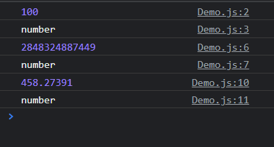
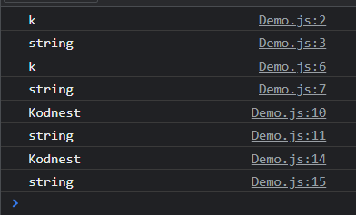
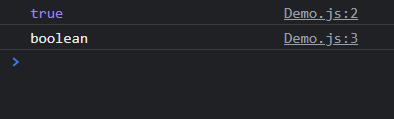
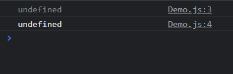
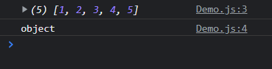

# Variables and Datatypes in Javascript

## Statically typed language and Dynamically typed languages

- **Statically typed languages** are such languages where the datatype of the variable must be specified by the programmer.

  eg: Java, C , C++.

- **Dynamically Typed language** are such languages where the datatype of the variable is specified by the language interpreter during runtime.

  eg: Javascript, Python, Ruby.

## Variables in Javascript

To declare variable in javascript, datatype is not provided by the programmer but the variable names in javascript must be declared using three keywords:

i.e : `var`, `let` and `const`

### Example

```js
var n = 100;
document.write(n + " ");

let x = 200;
document.write(x + " ");

const y = 500;
document.write(y + " ");
```

### Output :


# Redefining the variable inside the scope

## var

```js
{
  var n = 200;
  console.log(n);
  var n = 300;
  console.log(n);
}
```

> ### Output
>
> 

## let

```js
{
  let n = 200;
  console.log(n);
  let n = 300;
  console.log(n);
}
```

> ### Output
>
> 

## const

```js
{
  const n = 200; // SyntaxError: Identifier 'y' has already been declared
  console.log(n);
  const n = 300;
  console.log(n);
}
```

> ### Output
>
> 

# Reinitializing the variable inside the scope

## var

```js
{
  var n = 200;
  console.log(n);
  n = 300;
  console.log(n);
}
```

> ### Output
>
> 

## let

```js
{
  let n = 200;
  console.log(n);
  n = 300;
  console.log(n);
}
```

> ### Output
>
> 

## const

```js
{
  const n = 200;
  console.log(n);
  n = 300;
  console.log(n);
}
```

> ### Output
>
> 

## Defrences

| var                                                                     | let                                                                        | const                                                                        |
| ----------------------------------------------------------------------- | -------------------------------------------------------------------------- | ---------------------------------------------------------------------------- |
| Variable declared using `var` keyword can be accessed outside the scope | Variable declared using `let` keyword cannot be accessed outside the scope | Variable declared using `const` keyword cannot be accessed outside the scope |
| Variable can be redeclare once created.                                 | Variable cannot be redeclare are once created                              | Variable cannot be redeclared once created.                                  |
| Variable can be reinitialized once declared.                            | Variable can be reinitialized once declared. created                       | Variable cannot be reinitialized once declared.                              |

## Note:

Every Languages will be having different flavours i.e

1. **Scripting Language**: In scripting style of programming, code doesn't include class object or functions. Scripting language use interpretation.

2. **Procedural Language**: In procedural style of programming, only functions will be there.

   - Eg: C

3. **Object-Oriented Language**: In Object-oriented style of programming, class objects methods will be there and programming languages will be compiled and interpreted languages.
   - Eg: Java, C++

# Datatype

1. Number
1. String
1. Boolean
1. nu11
1. undefined

## Number

<dd>In Javascript any size of numbers, whole number ald real number is stored using the "number" datatype.</dd>

```js
var n = 100;
console.log(n);
console.log(typeof n);

n = 2848324887449;
console.log(n);
console.log(typeof n);

n = 458.27391;
console.log(n);
console.log(typeof n);
```



## String

```js
let s = "k";
console.log(s);
console.log(typeof s);

let s1 = "k";
console.log(s1);
console.log(typeof s1);

let s2 = "Kodnest";
console.log(s2);
console.log(typeof s2);

let s3 = "Kodnest";
console.log(s3);
console.log(typeof s3);
```



## Boolean

```js
let b = true;
console.log(b);
console.log(typeof b);
```



## Null

```js
var s;
console.log(s); //null
console.log(typeof s); //object
```

## Undefined

```js
var s;
console.log(s);
console.log(typeof s);
```



## Array

```js
var a = [1, 2, 3, 4, 5];
console.log(a);
console.log(typeof a);
```


