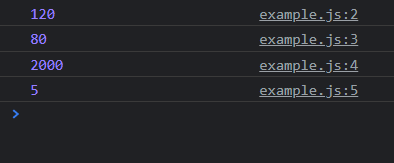
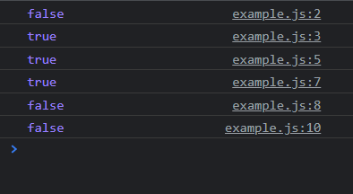
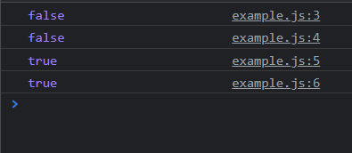
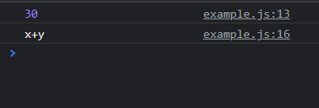
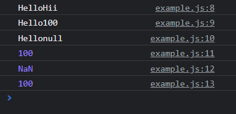

# Operators in Javascript

- Arithmetic Operators: + - * /
- Relational Operators: < > <= >= ==
- Logical Operators   : && ||
- Ternary Operator    : ?:
- String Operator     : +

## 1. Arithmetic Operators
### Example
```js
var n=100,m=20
console.log(n+m)
console.log(n-m)
console.log(n*m)
console.log(n/m)
```


## 2. Relational Operators
### Example
```js
var a = 100, b = 25
console.log(a < b)
console.log(a > b)
// b < a or b == a
console.log(b <= a)
// a > b or a==b
console.log(a >= b)
console.log(a == b)
// a > 200 0r a == 200
console.log(a >= 200)
```



## Logical Operators
### Example
```js
var a = 10, b = 20

console.log(a > b && b == a);
console.log(a > b || b == a);
console.log(a <= b && b != a);
console.log(a <= b || b == a);
```


## Ternary Operator

### Syntax
```
condition ? exp1 : exp2
```

- if the condition is true then expression 1 will be evaluated and returned
- if the condition is false then expression 2 will be evaluated and returned

### Example

```js
var x = 10, y = 30
var z = (x>y || y!=x) ? x+20 : x-5
console.log(z);

var z = (x<=y && y==x) ? "y-20" : "x+y"
console.log(z);
```


## String Operator

```js
console.log("Hello" + "Hii");
console.log("Hello" + 100);
console.log("Hello" + null);
console.log(100 + null);
console.log(100 - "Raj");
console.log(100 - null);
```
